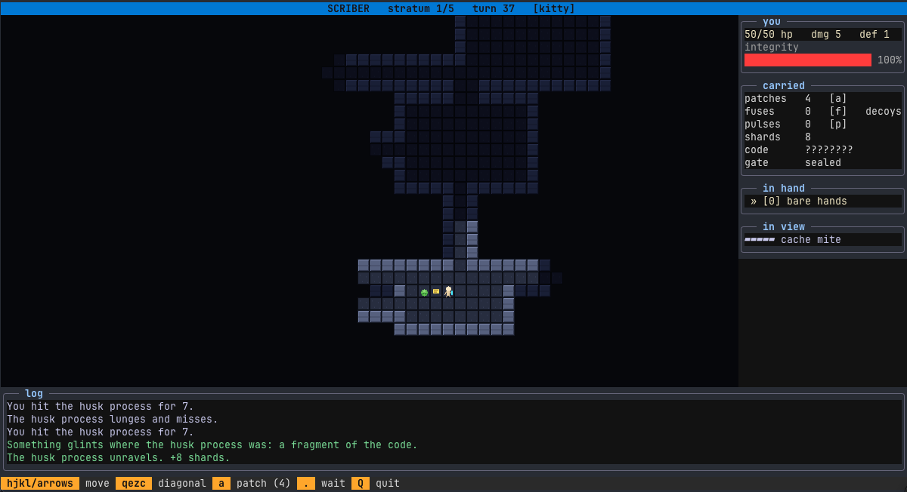
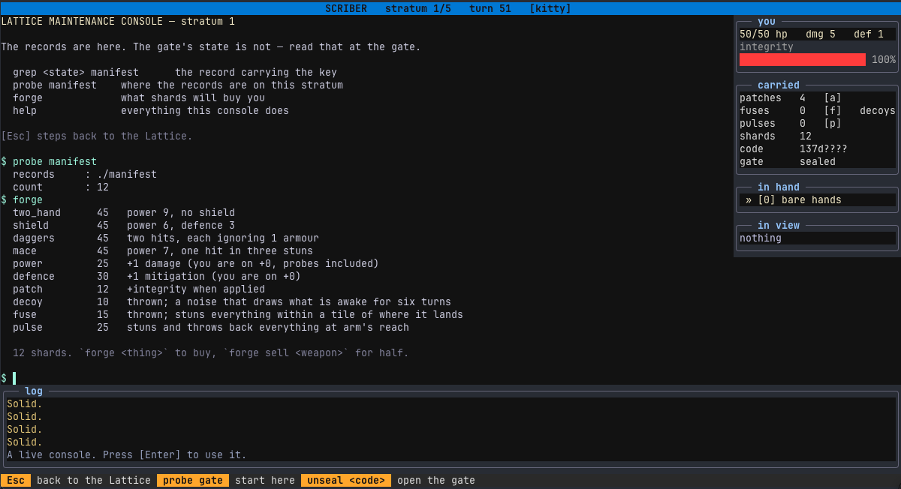

# Scriber

A roguelike drawn in real pixels, with a console inside it, on [Cauldron](https://github.com/jaman/cauldron).

[](https://www.youtube.com/watch?v=AYlxc8u1FOw)

A descent, with the sound, is [on YouTube](https://www.youtube.com/watch?v=AYlxc8u1FOw).



You are a maintenance construct inside the Lattice, a machine that is failing. Five strata
down is the way out. Each stratum's gate is sealed, and the code that opens it is not an item
and cannot be fought for — it is written in files, on a console, and you get it by running
real commands against them.



```bash
mix scriber
mix scriber --seed 1234      # replay a particular run
mix scriber --mode text      # glyphs, even where the terminal has pixels
```

## What each library does here

| | |
|---|---|
| [Cauldron](https://github.com/jaman/cauldron) | the engine — the run is a `Cauldron2D.Game` in a `Cauldron2D.World` stepped once per key, the tiles are a `Cauldron2D.Atlas`, and `Cauldron2D.Drafter.Surface` draws the map from the world's view: pixels through the terminal's graphics protocol where it has one, glyphs where it has not |
| [`drafter`](https://hex.pm/packages/drafter) | the application — layout, keys, the console mode and the epitaph, headless tests |
| [`french_curve`](https://hex.pm/packages/french_curve) | the art — every tile is a sprite drawn in code with `FrenchCurve.Draw`, composited into one image a frame |

## The consoles

Every stratum has a console. Standing on it and pressing `Enter` gives you a prompt:

```
$ probe gate
gate node   : stratum-1 gate
state       : migrated
key         : withheld — held in the node records

$ grep migrated manifest
node-92aa  state=migrated  key=b6f69d5b

$ unseal b6f69d5b
code accepted.
the gate is open. step back to the Lattice and descend.
```

The prompt is `Scriber.Console`, a shell-like command set in Elixir — `ls`, `cat`, `grep`,
`probe`, `unseal`, `forge`, `clear`, `help` — over a real directory under
`~/.local/state/scriber/runs/<seed>/stratum-<n>/` that `Scriber.Lattice` wrote. `.seal`
holds the SHA-256 of the code rather than the code, so reading every file in the directory
still does not hand you the answer. From stratum 3 the node records are sharded into `logs/`
and you need `grep` across them.

The game never learns the code was accepted through a message. `unseal` writes an `unsealed`
marker and the application watches for that file, then sends the world `:unseal`. It works
if you write the marker by any other means.

`Esc` steps back to the Lattice. The stratum's files, and the marker saying its gate is open,
stay on disk.

## The run is a world

`Scriber.Game` is a `Cauldron2D.Game`: a value, and pure callbacks over it. `Scriber.App`
starts a `Cauldron2D.World` of the player's own with `tick: :on_input` — no clock; the world
steps once each time input arrives — and every key becomes one action (`:move_ne`, `:wait`,
`:use`, `:equip_2`, `:descend`, ...) sent as input. The frame the world sends back is what
is drawn, and its events (`{:descended, depth}`) are where the two side effects of a turn
happen: writing the next stratum's files and switching the ambience.

A purchase at the console is the same: `Scriber.Console` runs `forge` against the view to
print its answer, records the transaction as an action (`:buy_patch`, `:sell_mace`), and
the application sends that to the world, which is the only thing that changes the game.
`Cauldron2D.Test` drives the game as the world would, in the tests, and a run started with
`record: true` keeps a `Cauldron2D.Replay`.

## The map is an image

Where the terminal supports a pixel protocol, the map is not characters. Each tile is a 16×16
RGBA sprite drawn with `FrenchCurve.Draw` primitives — no asset files and no image decoder —
installed as a `Cauldron2D.Atlas`, and a frame is those sprites composited by
`Cauldron2D.Surface` into one raster and transmitted through the terminal's protocol: kitty,
iTerm2 or sixel, as `Cauldron2D.Renderer` detects it or `SCRIBER_MODE` forces it.

Tiles are two terminal cells wide and one tall. Cells are about twice as tall as they are
wide, so a square tile drawn across two of them stays square. Terminals with no pixel
protocol get two-cell coloured glyphs from the same atlas, so the two renderings cannot
disagree about what is visible.

## Where a run is kept

`$XDG_STATE_HOME/scriber/runs/<seed>/`, falling back to `~/.local/state/scriber/runs/<seed>/`.
`$SCRIBER_HOME` overrides both, which is also how the test suite keeps its own strata out of
yours.

The state directory rather than data or cache: a run is the position of something the player
is in the middle of. It is *mostly* regenerable — `prepare/2` rebuilds a stratum byte for byte
from its seed — but what the player did in the console is not, which is why it is neither a
cache directory nor `$TMPDIR`. On macOS `$TMPDIR` is a path like `/var/folders/…`: both
undiscoverable and periodically swept out from under a game you might come back to.

Runs are never deleted by the game. `Scriber.Lattice.runs/0` lists the seeds on disk and
`destroy/1` removes one, so a long-lived install accumulates a small directory per run until
you clear them.

## Playing

| key | |
|---|---|
| `hjkl` `yubn` `qezc`, arrows | move; walk into something to attack it, or slip past it if it is stunned |
| `.` or `s` | wait — silently |
| `Enter` | use what you stand on: the console, or an open gate |
| `Esc` | step back from the console; put a tool away |
| `a` | apply a patch |
| `f` / `x` | throw a fuse / a decoy: the move keys aim, `Tab` picks the next creature in view, `Enter` throws |
| `p` | trigger a pulse |
| `>` | descend an open gate |
| `0`–`4` | take up bare hands, or a bought weapon |
| `m` | mute |
| `r` | begin another run, once this one is over |
| `Q` | quit |

Nothing hostile starts within sight of where you wake. Everything else will notice you when
you can see it — with exceptions worth knowing.

## Creatures

Four kinds, four verbs:

| | | |
|---|---|---|
| **cache mite** | avoid | quick and brittle; runs when hurt and comes back |
| **husk process** | outrun | slow and heavy; moves every other turn, so it can be walked around or fought in a doorway |
| **page sentry** | choose | never moves; wakes only when you come within three tiles or strike it, and sits on what it guards |
| **orphaned daemon** | sneak | fast, and hunts by sound: your footsteps within twelve tiles wake it; waiting is silent. From stratum 3 one guards the gate's room |

A creature that has not seen you for five turns settles back to sleep, so retreat is a real
move. Strikes miss — yours on `d10 > 1 + its defence`, theirs on yours — and a creature
strikes or moves in a turn, never both. Some carry a **fragment** of the gate's code (two,
three, then four a stratum) and drop it where they die; `probe gate` at the console shows the
characters in hand, `b6??9d??`, which is that much less to `grep` for.

## Tools

Found lying about, or bought at the forge:

* **fuse** — thrown at a tile in view within six; stuns everything within a tile of it for
  two turns. A stunned creature is walked past
* **decoy** — thrown; a noise that draws what is awake for six turns, daemons included
* **pulse** — no aim: everything at arm's reach is thrown back a tile and stunned for a turn.
  The panic button

Strata change as you go down: doors from stratum 2, which block sight until opened; the
gate's daemon from 3; sight shortens from 4. Descending hardens you by five integrity.

## Sound

Every event the game emits is placed where it happened and played against where you stand,
fading with distance: your own footsteps; a creature's step, chatter and cry from where it
is, so a daemon's double beat is heard from two rooms away before it is seen; each weapon's
swing and each creature's flesh on a hit; misses, parries, stuns, deaths; pickups, the patch,
the door, the console, the gate grinding open, the drop. `Scriber.Sound.voice/1` is the
table.

## Layout

```
lib/scriber/
  game.ex       the whole run as one value and a Cauldron2D.Game; command/2 is the only
                way it changes, and step/2 turns the actions pressed into commands
  level.ex      procedural generation, and the tiles a stratum is made of
  entity.ex     the player and the daemons, one struct
  gear.ex       the weapons; forge.ex  what shards buy and sell
  lattice.ex    the real directory, the code, and the puzzle
  console.ex    the prompt over a stratum's directory
  art.ex        the tiles, drawn in code, installed as an atlas
  renderer.ex   SCRIBER_MODE over Cauldron2D.Renderer
  sound.ex      the ambience, one bed a stratum, and the voice of every event, on a
                Cauldron2D.Audio of the app's own
  ambience.ex   the beds
  app.ex        the drafter application: the world, the keys, the console mode
```

`Scriber.Game` has no dependency on drafter or a terminal: it is a function from a state and
a command to the next state, and a whole run can be played out in a test by folding commands
over it. The random numbers are `Cauldron2D.Rng`, carried in the state so a seed reproduces
a run; the field of view is `Cauldron2D.Grid.Fov` over `Scriber.Level.transparent?/2`.

## Tests

```bash
mix test
```

They cover the pure core by playing it, shadowcasting against hand-drawn maps (including the
property that sight is mutual), the puzzle by reading the files `Scriber.Lattice` writes,
the game as a world through `Cauldron2D.Test`, and the application headlessly through
`Drafter.Test`, the console included.

Screen assertions poll rather than reading immediately: the world answers a key with a frame
a moment later, and the application paints a few milliseconds after that.
